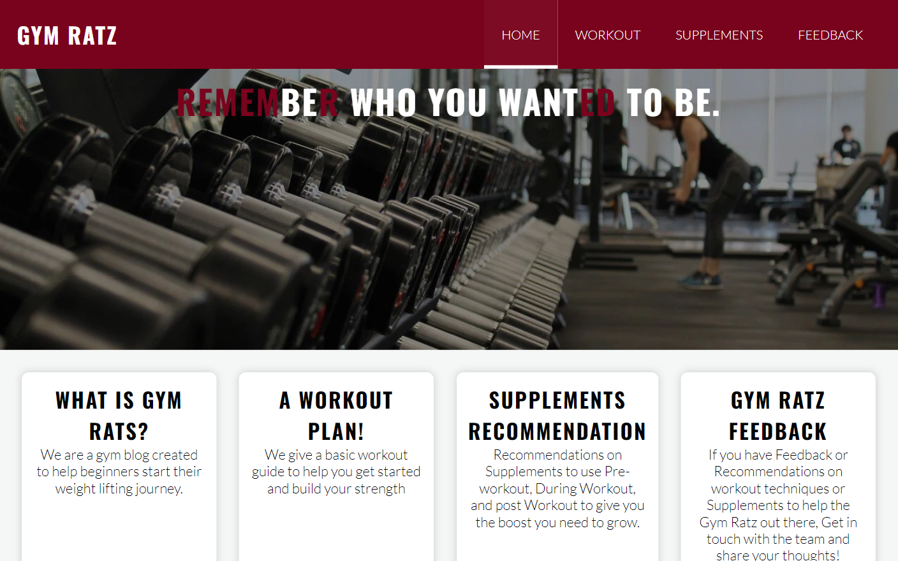
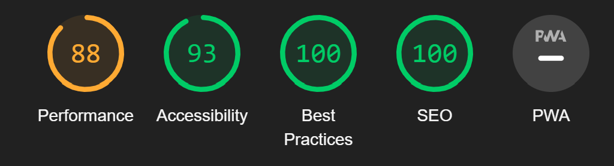
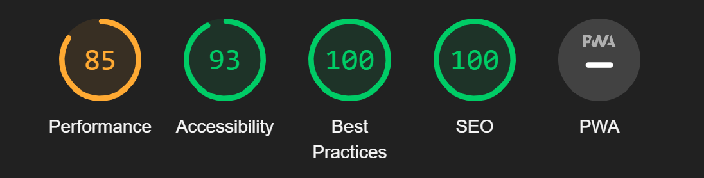
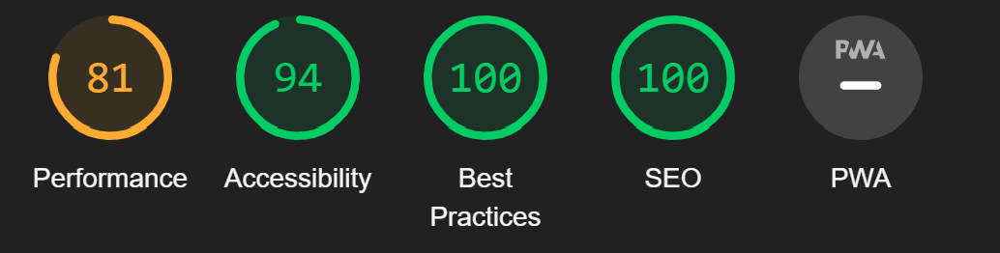
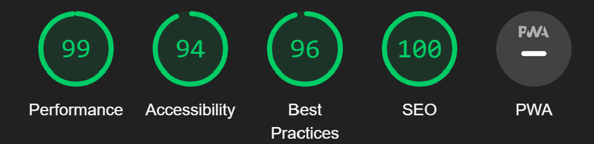
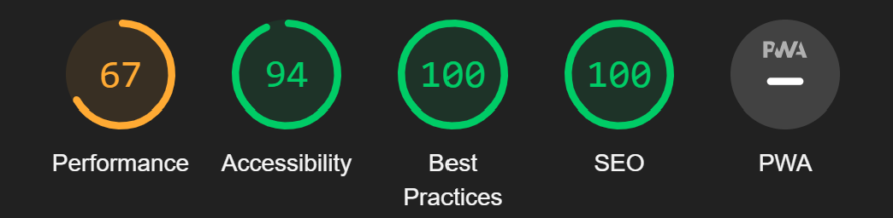
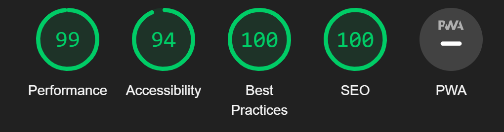
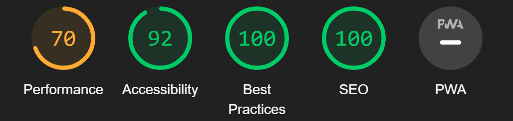
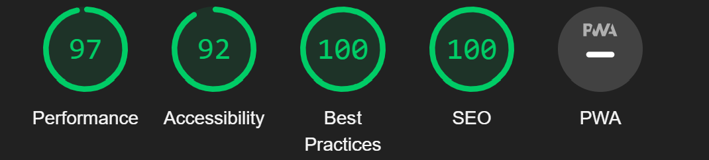

# Gym Ratz

Welcome to Gym Ratz, your go-to resource for workout plans and supplement recommendations, tailored especially for beginners.

[Click here](https://brandonn3lson.github.io/Gym-Ratz/) to see deployed website!

## Table of Contents

- [About](#about)
- [Features](#features)
- [Technologies used](#technology)
- [Deployment](#deployment)
- [References](#references)

## About

Gym Ratz is a gym blog designed to assist beginners in embarking on their weightlifting journey. Whether you're just starting out or looking for guidance to enhance your workouts, Gym Ratz has got you covered.

## Features

  - **Workout Plan**: Get started with our basic workout guide to build your strength and endurance.
  - **Supplements Recommendation**: Discover recommendations for pre-workout, during workout, and post-workout supplements to help you achieve your fitness goals.
  - **Feedback**: Share your thoughts and recommendations on workout techniques and supplements with the Gym Ratz team.

## Technologies Used
 ### Languages Used
  - Html
  - Css

 ### Frameworks and programs used
  - balsamic
  - git (for version control)
  - github (to save and store project)

 ### Design
  - [Cooler](https://coolors.co/palettes/popular). The color pallet that was used was created using Cooler
  - pexels (for images)
  - unsplash (for images)
  - pinterest (for images)
  - [Free Convert](https://www.freeconvert.com/jpg-to-webp) (Used to convert jpg to webp for better performance.)
  - [CSSMATIC](https://www.cssmatic.com/box-shadow) used for box-shadows

## Deployment

  Github Pages was used to deploy the live website. The instructions to achieve this are below:
  1. Log in (or sign up) to Github.
  2. Find the repository for this project, Gym Ratz.
  3. Click on the Settings link.
  4. Click on the Pages link on the left hand side.
  5. In the Source section, choose main from the drop down select branch menu. Select Root from the drop down select folder menu.
  6. Click Save. Your live Github Pages site is now deployed at the URL shown.

### Local Development

#### How to Fork

To fork the repository:
1. Log in (or sign up) to Github.
2. Go to the repository for this project, brandonn3lson/Gym-Ratz.
3. Click the Fork button in the top right corner.

## Testing and Validating
for testing and and trouble shooting, i used the chrome dev tools while building the website to fix any issues while working through the project.
 
  ### W3C validator
  * [Index Page HTML](assets/readme-images/index-w3c-validator.png)
  * [Workout Page Html](assets/readme-images/workout-w3c-validator.png)
  * [Supplements Page Html](assets/readme-images/supplement-w3c-validator.png)
  * [Feedback Page Html](assets/readme-images/feedback-w3c-validator.png)

  ### Lighthouse Analysis Report
  - #### index page
    ##### Mobile
    
    ##### Desktop
    

  - #### Workout page
    ##### Mobile
    
    ##### Desktop
    

  - #### Supplements page
    ##### Mobile
    
    ##### Desktop
    

  - #### Feedback page
    ##### Mobile
    
    ##### Desktop
    

## Issues

  ### Tools used
  * [Wave evaluation tool](https://wave.webaim.org/)

   - using an input checkbox for a toggle for the dropdown navigation bar reduced the accessibility score of the wesite, if i were to re make this website i would use a button to get rid of this problem.

     [image of issue](assets/readme-images/wave-evaluation-tool.png)

## References
 - the google font style was taken from love running project
 - Navigation bar idea was taken from a Youtube video. [Nav bar youtube link](https://www.youtube.com/watch?v=XM7sEpl0f7c)
